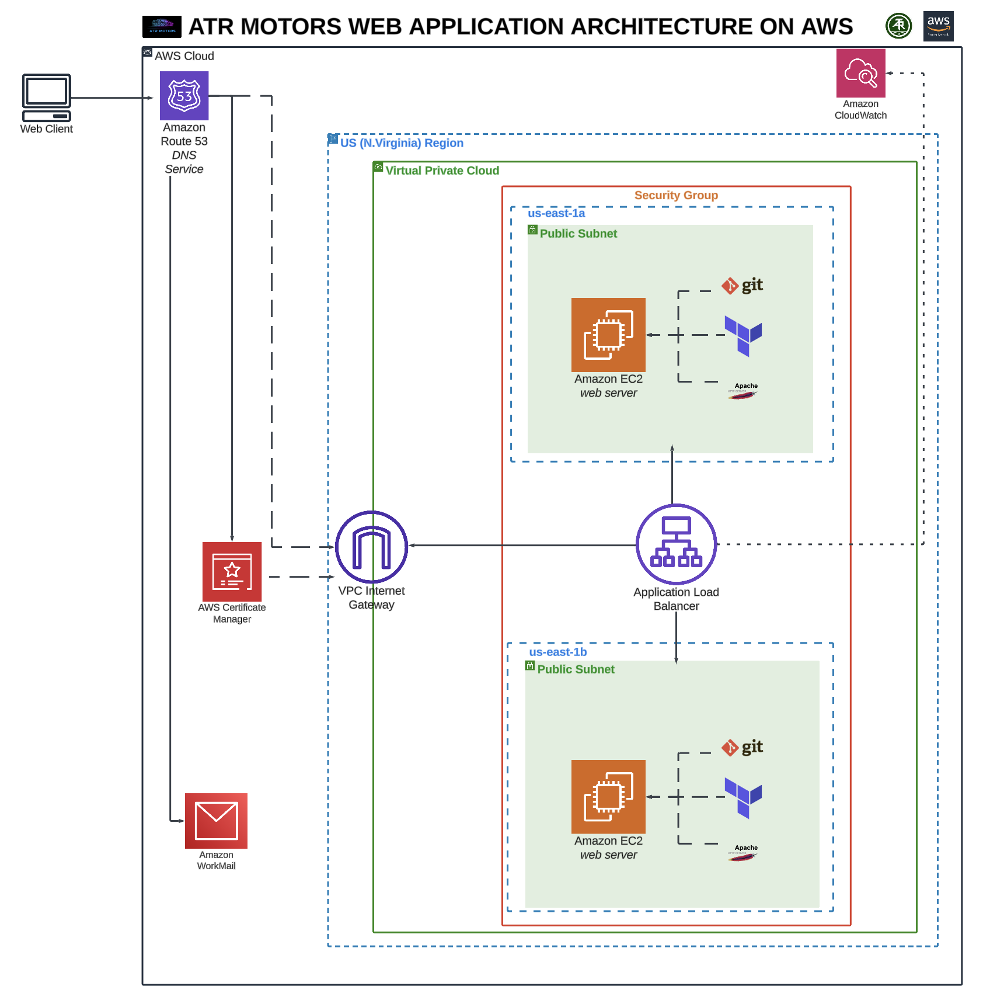

# Technical Documentation: Migration of atrmotors.com to AWS Cloud Infrastructure

## Project Overview

**Objective:**  
Migrate atrmotors.com from Hostinger to AWS to improve scalability, reliability, and performance for a luxury car shop website. This migration will leverage Amazon Web Services (AWS) to establish a secure, highly available, and scalable architecture tailored to the organization’s needs.

**Goals:**

- Improve website reliability and performance.
- Enhance security with AWS native services and HTTPS support.
- Enable seamless scaling for future traffic growth.
- Minimize downtime during and after migration.

---

## Table of Contents

1. [Target Architecture](#target-architecture)
2. [AWS Services Utilized](#aws-services-utilized)
3. [Migration Phases](#migration-phases)
4. [Potential Challenges and Mitigations](#potential-challenges-and-mitigations)
5. [Rollback Plan](#rollback-plan)
6. [Success Criteria](#success-criteria)
7. [Post-Migration Tasks](#post-migration-tasks)
8. [Budget Considerations](#budget-considerations)
9. [Appendix: Technical Details](#appendix-technical-details)

---

## Target Architecture

The following AWS services and resources were configured in the target architecture:

### Components

- **Route 53**: DNS management and domain routing.
- **Elastic Load Balancer (ALB)**: Distributes incoming traffic evenly across multiple instances.
- **EC2**: Hosts the website on two instances for redundancy and high availability.
- **AWS Certificate Manager (ACM)**: Issues free SSL/TLS certificates for secure connections.
- **CloudWatch**: Monitors system performance and logs.

---

## AWS Services Utilized

### 1. **Compute & Networking**

- **EC2 Instances**: Two `t2.micro` instances (free tier eligible) running Ubuntu 22.04 LTS.
- **Elastic Load Balancer (ALB)**: Routes and balances traffic across EC2 instances.
- **Route 53**: Manages domain DNS and enables smooth domain routing.

### 2. **Security**

- **AWS Certificate Manager (ACM)**: Provides and manages SSL certificates for secure HTTPS connections.
- **Security Groups**: Configured to allow HTTP (port 80) and HTTPS (port 443) traffic to the load balancer.

### 3. **Monitoring**

- **CloudWatch**: Tracks metrics like CPU usage, network traffic, and error rates.

---

## Migration Phases

### Phase 1: Preparation

- Reviewed existing architecture and identified limitations with the Hostinger environment.
- Retrieved website files using a web copier tool due to limited access to the original hosting account.
- Planned and documented migration architecture, DNS settings, and rollback strategy.

### Phase 2: Infrastructure Setup

- Deployed two EC2 instances in separate availability zones (`us-east-1a` and `us-east-1b`) to ensure redundancy and fault tolerance.
- Installed and configured the Apache web server on both EC2 instances.
- Transferred static website files to the server's root directory from the GitHub repository:  
  [https://github.com/PaulBoye-py/atr-motors-arthurite.git](https://github.com/PaulBoye-py/atr-motors-arthurite.git).

### Phase 3: Load Balancer Setup

- Configured an Application Load Balancer (ALB) to distribute incoming traffic between the two EC2 instances.
- Set up a target group with both instances and verified healthy instance checks.
- Applied ACM SSL certificates to enable HTTPS and configured HTTP-to-HTTPS redirection.

### Phase 4: DNS Configuration

- Updated DNS records in Route 53 to point to the ALB’s DNS name.
- Verified DNS propagation and confirmed domain resolution to the AWS-hosted website.

### Phase 5: Testing

- Verified load balancer traffic distribution and EC2 instance functionality.
- Conducted security checks to ensure HTTPS connections worked without warnings.
- Validated performance under moderate traffic conditions.

---

## Potential Challenges and Mitigations

1. **File Retrieval Challenges**
   - **Mitigation**: Used a web copier tool to crawl and retrieve files from the Hostinger-hosted website.

2. **DNS Propagation Delays**
   - **Mitigation**: Lowered DNS TTL values before migration and closely monitored propagation.

3. **Performance Optimization**
   - **Mitigation**: Set up CloudWatch metrics and alarms to monitor performance and troubleshoot any bottlenecks.

---

## Rollback Plan

1. Maintain backups of website files and DNS records from Hostinger.
2. Keep Hostinger services active for 7 days post-migration.
3. Revert DNS settings to the original Hostinger configuration if migration issues occur.

---

## Success Criteria

- Website accessible through the domain name (`atrmotors.com`) with no errors.
- HTTPS enabled with valid SSL certificates and secure traffic redirection.
- Traffic evenly distributed across both EC2 instances by the load balancer.
- High availability ensured, with no downtime during simulated instance failure.
- Monitoring metrics active in CloudWatch to track system health and performance.

---

## Post-Migration Tasks

1. **Monitoring**: Use CloudWatch to continuously monitor infrastructure performance and detect anomalies.
2. **Documentation**: Provide detailed configuration documentation, including EC2, ELB, ACM, and Route 53 setups.
3. **Handover**: Share documentation and conduct a walkthrough for stakeholders.
4. **Decommissioning**: Deactivate Hostinger services after confirming migration success.

---

## Budget Considerations

### Estimated Costs

| Service                | Cost Estimate (Annual) |
|------------------------|-------------------------|
| EC2 Instances          | Free (t2.micro)        |
| Application Load Balancer | $317                  |
| Route 53               | $14                    |
| SSL Certificates       | Free (via ACM)         |
| CloudWatch Monitoring  | Free Tier              |

**Total Estimated Cost:** $380/year.

---

## Appendix: Technical Details

1. **EC2 Configuration**
   - Instances launched with AMI: `ami-0e8d228ad90af673b` (Ubuntu 22.04 LTS).
   - Apache web server installed and configured on both instances.

2. **Load Balancer Setup**
   - Configured with a target group and HTTP/HTTPS listeners.
   - ACM SSL certificates applied for secure communication.

3. **DNS Configuration**
   - Route 53 hosted zone updated with A and CNAME records pointing to the ALB.

4. **Monitoring**
   - CloudWatch metrics set up for CPU, network traffic, and instance health.
   - Alarms configured for abnormal resource utilization.
